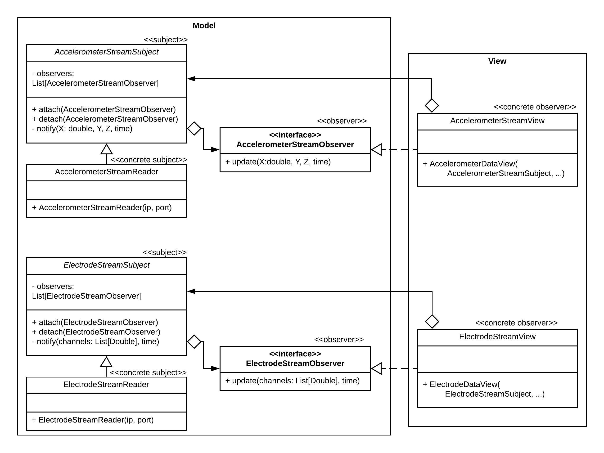

# (Semi-)Detailed Design

The purpose of this document is to describe the design of the *System Manager* subsystem. For a description of the sub-system and its place in the context of the larger system, see the [system overview](system_overview.md) document.

The design will be described at a semi-detailed level, with the intent to quickly capture major design decisions. It will not capture lower level implementation details for each component.

## High Level Separation of Concerns

The sub-system will be separated according to the Model-View-Controller pattern. This is a common pattern to provide a separation of concerns between the GUI (view-controller) and backend (model) of the sub-system. The important point is that the view should always represent the state of the model, and user interactions should update the model (via the controller). User interactions should almost never directly update the view.

## Stream View

One of the desired features of the GUI is to have a live display of the accelerometer and electrode data coming from the OpenBCI Cyton board. The data will be coming from a UDP stream on localhost, provided by the OpenBCI GUI.

The stream viewing functionality will be facilitated by a sightly modified observer pattern. There will be objects to read from each of the data streams continually, likely utilizing threads. When data is received, the reader objects will `notify()` observers by directly sending them the newly received data. The view objects receive the new data through their `update()` method, they will perform the necessary actions to update the view. This deviates from the standard observer pattern because the new data is sent along with the `update()`, making this implementation more like a pub-sub messaging pattern.